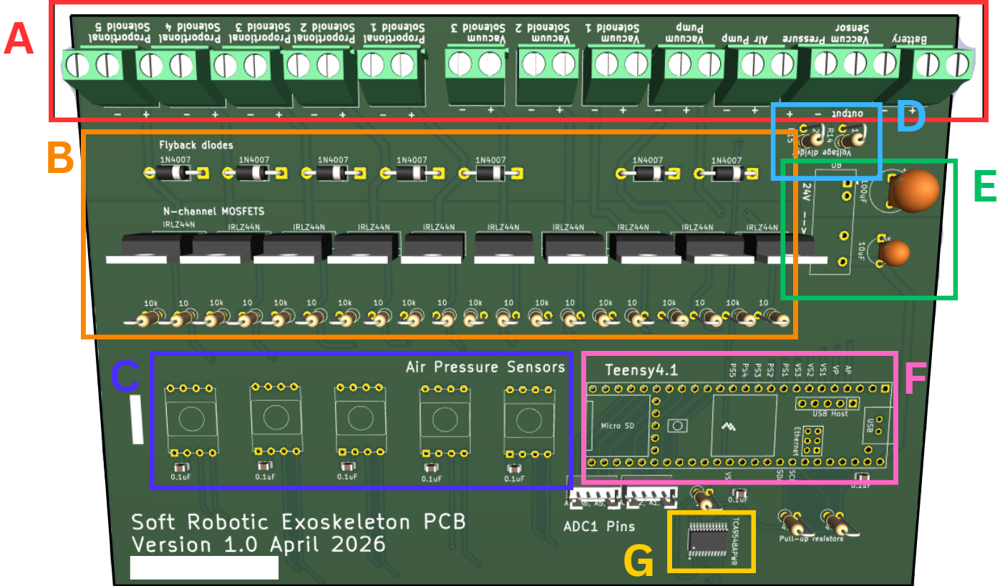

# PCB Design
The custom PCB design is made to accommodate all the electronics needed for a
full glove system and uses a Teensy 4.1 micro-controller. It was manufactured by JLCPCB using an FR-4 substrate. 
Components were manually soldered to the board, with the 0805 surface-mount capacitors and TSSOP multiplexer soldered using a reflow process. 

This folder contains the KiCad files and gerber files associated with the first iteration of the PCB design.  
